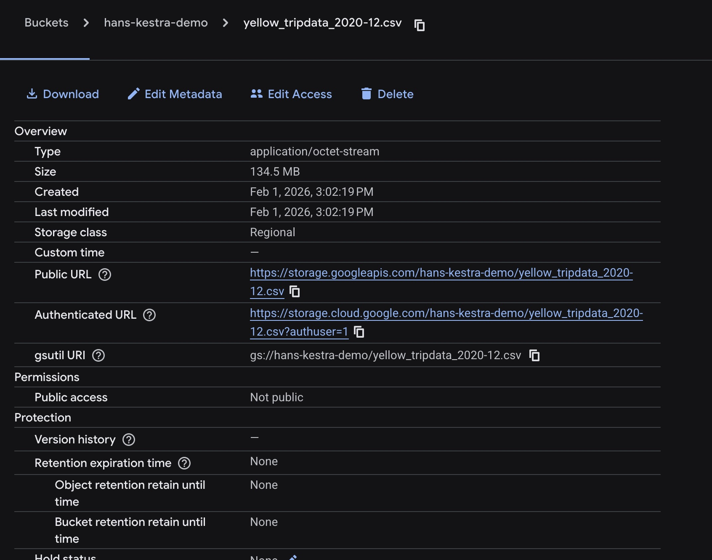

DE-Homework-2

Question 1

Answer: 134.5 MiB

Question 2

Answer: green_tripdata_2020-04.csv

Question 3

SELECT count(*)
FROM `dtc-kestra-project.zoomcamp.yellow_tripdata`
WHERE tpep_pickup_datetime >= TIMESTAMP('2020-01-01')
  AND tpep_pickup_datetime <  TIMESTAMP('2021-01-01');

Answer: 24,648,499

Question 4

SELECT count(*)
FROM `dtc-kestra-project.zoomcamp.green_tripdata`
WHERE lpep_pickup_datetime >= TIMESTAMP('2020-01-01')
  AND lpep_pickup_datetime <  TIMESTAMP('2021-01-01');

Answer: 1,734,051

Question 5

SELECT count(*)
FROM `dtc-kestra-project.zoomcamp.yellow_tripdata`
WHERE tpep_pickup_datetime >= TIMESTAMP('2021-03-01')
  AND tpep_pickup_datetime <  TIMESTAMP('2021-04-01');

Answer: 1,925,152

Question 6

Answer: Add a timezone property set to America/New_York in the Schedule trigger configuration

